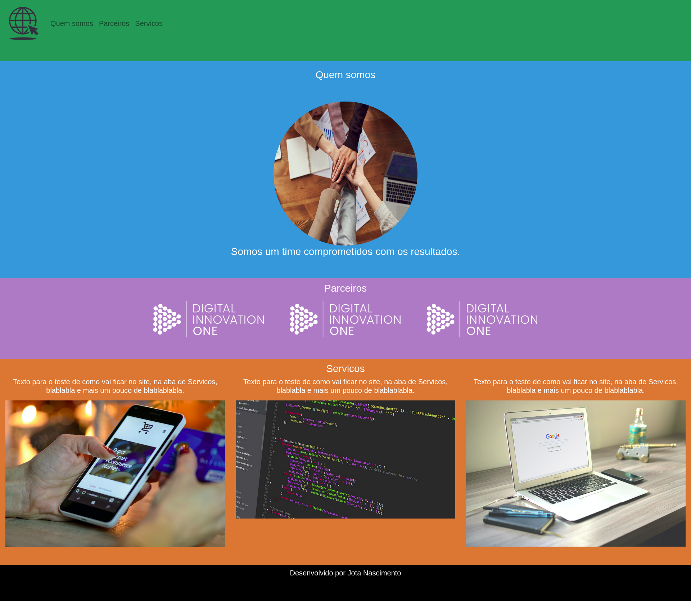

# Bootstrap

> Utilizando bootstrap

Projeto construído para introdução ao bootstrap

[Clique aqui para acessar.](https://ocnjota.github.io/aula_bootstrap/)

## 🛠️ Tecnologias

- HTML
- CSS
- Git e Github 
- Bootstrap

## ✉️ Contato

jrnascimento09@gmail.com